# 🏗️ DDD (Domain-Driven Design) + Arquitectura Hexagonal

## 🎯 **¿Qué es DDD?**

**Domain-Driven Design** es una metodología de desarrollo que pone el **dominio del negocio** en el centro de la aplicación. Fue creado por Eric Evans y se basa en estos principios fundamentales:

### 📋 **Principios Clave de DDD:**

1. **🗣️ Lenguaje Ubicuo (Ubiquitous Language)**
   - Mismo vocabulario entre desarrolladores y expertos del dominio
   - En tu proyecto: `Vehiculo`, `Parqueadero`, `ingresar`, `sacar`

2. **🎯 Dominio como Centro**
   - La lógica de negocio es independiente de la tecnología
   - Sin dependencias hacia frameworks o infraestructura

3. **📦 Bounded Contexts**
   - Límites claros donde cada concepto tiene un significado específico
   - Tu proyecto representa el contexto "Gestión de Parqueadero"

4. **🏛️ Modelos Ricos**
   - Objetos con comportamiento, no solo datos (anémicos)
   - Entidades, Value Objects, Aggregates, Domain Services

---

## 🤝 **DDD + Arquitectura Hexagonal: La Combinación Perfecta**

### ✅ **¿Por qué funcionan tan bien juntos?**

| Aspecto | DDD | Arquitectura Hexagonal |
|---------|-----|------------------------|
| **Objetivo** | Proteger el dominio | Aislar el dominio |
| **Dependencias** | Dominio independiente | Puertos invierten dependencias |
| **Testing** | Mock de servicios externos | Mock de adaptadores |
| **Evolución** | Cambios centrados en negocio | Cambios en infraestructura sin afectar dominio |

---

## 🔍 **Análisis DDD de tu Proyecto Parqueadero**

### 🎯 **1. Domain Layer (Corazón DDD)**

```
📁 domain/
├── 🏛️ model/
│   ├── Vehiculo.java           ← ENTITY (Aggregate Root)
│   └── TipoVehiculo.java       ← VALUE OBJECT / ENUM
├── 🔧 service/
│   └── ParqueaderoService.java ← DOMAIN SERVICE
└── 🚪 port/
    ├── in/ParqueaderoUseCase.java  ← APPLICATION SERVICE INTERFACE
    └── out/VehiculoRepository.java ← REPOSITORY INTERFACE
```

### 🏛️ **2. Patrones DDD Identificados en tu Código:**

#### **🔹 Entity (Aggregate Root)**
```java
// Vehiculo es una ENTITY en DDD
public class Vehiculo {
    // Tiene identidad (placa)
    // Tiene comportamiento rico
    // Mantiene invariantes del dominio
    
    public static Vehiculo crear(String placa, TipoVehiculo tipo) {
        // FACTORY METHOD
        // Garantiza que el objeto se crea en estado válido
    }
    
    public Vehiculo marcarSalida() {
        // DOMAIN BEHAVIOR
        // Cambio de estado controlado por el dominio
    }
}
```

#### **🔹 Value Object**
```java
// TipoVehiculo es un VALUE OBJECT
public enum TipoVehiculo {
    CARRO(3000), MOTO(2000);
    
    // Inmutable
    // Sin identidad propia
    // Define comportamiento (getTarifaPorHora)
}
```

#### **🔹 Domain Service**
```java
// ParqueaderoService es un DOMAIN SERVICE
@Service
public class ParqueaderoService implements ParqueaderoUseCase {
    
    // Contiene lógica que no pertenece a una entidad específica
    // Orquesta operaciones complejas del dominio
    // Ejemplos: calcularCosto, validar reglas de ingreso
}
```

#### **🔹 Repository Pattern**
```java
// VehiculoRepository sigue el patrón REPOSITORY de DDD
public interface VehiculoRepository {
    // Abstracción del dominio
    // Oculta detalles de persistencia
    // Simula una colección en memoria
}
```

---

## 🏗️ **Estructura DDD + Hexagonal en tu Proyecto**

### 📊 **Mapeo de Conceptos:**

```mermaid
graph TB
    subgraph "🌐 Application Layer"
        AC[Application Controller<br/>- ADAPTER -]
        DTO[DTOs<br/>Request/Response]
    end
    
    subgraph "🎯 Domain Layer (DDD Core)"
        subgraph "Domain Services"
            DS[ParqueaderoService<br/>DOMAIN SERVICE]
        end
        
        subgraph "Domain Models"
            E[Vehiculo<br/>ENTITY/AGGREGATE]
            VO[TipoVehiculo<br/>VALUE OBJECT]
        end
        
        subgraph "Domain Contracts"
            UC[ParqueaderoUseCase<br/>APPLICATION SERVICE]
            REPO[VehiculoRepository<br/>REPOSITORY INTERFACE]
        end
    end
    
    subgraph "🔧 Infrastructure Layer"
        RA[VehiculoRepositoryAdapter<br/>- ADAPTER -]
        JPA[Spring Data JPA]
        DB[(Database)]
    end
    
    AC --> UC
    UC --> DS
    DS --> E
    DS --> VO
    DS --> REPO
    REPO --> RA
    RA --> JPA
    JPA --> DB
    
    classDef dddCore fill:#222,stroke:#4a148c,stroke-width:3px
    classDef dddEntity fill:#333,stroke:#2e7d32,stroke-width:2px
    classDef adapter fill:#222,stroke:#f57c00,stroke-width:2px
    
    class DS,E,VO,UC,REPO dddCore
    class AC,RA adapter
```



---

## 🎪 **Beneficios de DDD + Hexagonal en tu Proyecto**

### ✅ **1. Independencia Tecnológica**
```java
// El dominio NO depende de Spring, JPA, o HTTP
// Solo depende de abstracciones (puertos)
public class ParqueaderoService {
    private final VehiculoRepository vehiculoRepository; // ← Abstracción
    
    // Lógica pura de negocio
    // Sin @Entity, @RestController, @Repository
}
```

### ✅ **2. Testing Simplificado**
```java
// Test del dominio SIN Spring Context
@Test
void deberiaCalcularCostoCorrectamente() {
    // ARRANGE
    VehiculoRepository mockRepo = mock(VehiculoRepository.class);
    ParqueaderoService service = new ParqueaderoService(mockRepo);
    
    // ACT & ASSERT
    // Prueba SOLO lógica de negocio
}
```

### ✅ **3. Evolución Controlada**
- **Cambios de negocio:** Solo afectan el dominio
- **Cambios técnicos:** Solo afectan adaptadores
- **Nuevos casos de uso:** Se agregan como métodos en el dominio

---

## 🚀 **Evolución hacia Microservicios DDD**

### 📦 **Bounded Contexts Identificados:**

Tu proyecto actual podría evolucionar a:

```
🏢 Sistema de Parqueaderos (Contexto General)
├── 🚗 Gestión de Vehículos    ← Tu proyecto actual
├── 💰 Facturación y Pagos     ← Futuro microservicio
├── 👥 Gestión de Clientes     ← Futuro microservicio
└── 📊 Reportes y Analytics    ← Futuro microservicio
```

### 🔄 **Integración entre Bounded Contexts:**
```java
// Futura integración con Domain Events
public class VehiculoSalida {
    // Cuando un vehículo sale, se emite un evento
    // El contexto de Facturación lo escucha
    // Se genera automáticamente la factura
}
```

---

## 🎯 **Recomendaciones para Profundizar DDD**

### 📚 **1. Conceptos DDD para Implementar:**

- **🎪 Domain Events:** Para comunicación entre bounded contexts
- **📊 Specifications:** Para consultas complejas del dominio
- **🏭 Factories:** Para creación compleja de agregados
- **🌊 Value Objects:** Para conceptos como "Tiempo de Estancia"

### 🛠️ **2. Archivos a Crear:**

```
📁 domain/
├── event/
│   ├── VehiculoIngresado.java      ← Domain Event
│   └── VehiculoSalio.java          ← Domain Event
├── specification/
│   └── VehiculoSpecification.java  ← Query Specification
└── factory/
    └── VehiculoFactory.java        ← Complex Creation Logic
```

---

## 🎁 **Conclusión**

Tu proyecto **YA IMPLEMENTA DDD** de manera excelente:

✅ **Dominio Puro:** Sin dependencias externas  
✅ **Modelos Ricos:** Vehiculo con comportamiento  
✅ **Domain Services:** ParqueaderoService con lógica de negocio  
✅ **Repository Pattern:** Abstracción de persistencia  
✅ **Use Cases Claros:** Interfaces bien definidas  

**DDD + Arquitectura Hexagonal** te da:
- 🛡️ **Protección** del dominio contra cambios técnicos
- 🧪 **Testabilidad** extrema de la lógica de negocio  
- 🔄 **Evolución** controlada hacia microservicios
- 🗣️ **Comunicación** clara con expertos del dominio

**¡Tu arquitectura está preparada para escalar a un sistema de microservicios completo manteniendo la pureza del dominio!**
