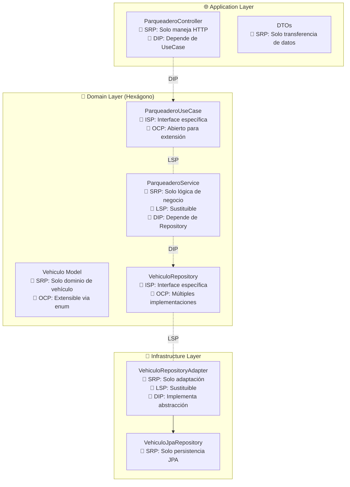

# 🎯 Principios SOLID en Arquitectura Hexagonal - Proyecto Parqueadero

## 📋 Introducción

Este documento analiza cómo se implementan los **5 principios SOLID** en nuestro proyecto de parqueadero usando **Arquitectura Hexagonal** con Spring Boot y Gradle. Cada principio se explica con ejemplos concretos del código.

---

## 🔍 Los 5 Principios SOLID

### 1️⃣ **S** - Single Responsibility Principle (SRP)
> **"Una clase debe tener una sola razón para cambiar"**

#### ✅ **Aplicación en el Proyecto:**

**🎯 ParqueaderoController**
```java
@RestController
@RequestMapping("/api/parqueadero")
public class ParqueaderoController {
    // ÚNICA RESPONSABILIDAD: Manejar peticiones HTTP del parqueadero
    // - Recibir requests HTTP
    // - Validar datos de entrada
    // - Delegar al caso de uso
    // - Retornar respuestas HTTP
}
```

**🎯 ParqueaderoService**
```java
@Service
public class ParqueaderoService implements ParqueaderoUseCase {
    // ÚNICA RESPONSABILIDAD: Lógica de negocio del parqueadero
    // - Validar reglas de negocio
    // - Coordinar operaciones del dominio
    // - Orquestar persistencia
}
```

**🎯 VehiculoRepositoryAdapter**
```java
@Component
public class VehiculoRepositoryAdapter implements VehiculoRepository {
    // ÚNICA RESPONSABILIDAD: Adaptación entre dominio e infraestructura
    // - Convertir entre entidades del dominio y de persistencia
    // - Delegar operaciones CRUD al JPA Repository
}
```

**🎯 Vehiculo (Domain Model)**
```java
public class Vehiculo {
    // ÚNICA RESPONSABILIDAD: Representar y validar un vehículo del dominio
    // - Mantener estado del vehículo
    // - Validar reglas de negocio propias
    // - Factory methods para creación
}
```

#### ❌ **Violación que se evita:**
Sin SRP, tendríamos una clase `ParqueaderoManager` que maneje HTTP, validaciones, lógica de negocio y persistencia.

---

### 2️⃣ **O** - Open/Closed Principle (OCP)
> **"Las entidades deben estar abiertas para extensión, pero cerradas para modificación"**

#### ✅ **Aplicación en el Proyecto:**

**🎯 Puerto de Entrada (ParqueaderoUseCase)**
```java
public interface ParqueaderoUseCase {
    Vehiculo ingresarVehiculo(String placa, TipoVehiculo tipo);
    Vehiculo sacarVehiculo(String placa);
    List<Vehiculo> consultarVehiculosActivos();
    // ABIERTO para extensión: Nuevos casos de uso
    // CERRADO para modificación: Interface estable
}
```

**🎯 Puerto de Salida (VehiculoRepository)**
```java
public interface VehiculoRepository {
    Vehiculo guardar(Vehiculo vehiculo);
    Optional<Vehiculo> buscarPorPlaca(String placa);
    // ABIERTO para extensión: Nuevas implementaciones de persistencia
    // CERRADO para modificación: Contrato estable
}
```

**🎯 Enum TipoVehiculo**
```java
public enum TipoVehiculo {
    CARRO(1000),
    MOTO(500);
    // FÁCIL EXTENSIÓN: Agregar BICICLETA(200), CAMION(1500)
    // SIN MODIFICAR código existente
}
```

#### 🚀 **Ejemplos de Extensión sin Modificación:**

1. **Nueva implementación de persistencia:**
```java
// Nuevo adaptador para MongoDB - SIN modificar código existente
@Component
public class VehiculoMongoRepositoryAdapter implements VehiculoRepository {
    // Implementación específica para MongoDB
}
```

2. **Nuevo tipo de notificación:**
```java
// Nuevo caso de uso - SIN modificar ParqueaderoService
@Service
public class NotificacionService implements NotificacionUseCase {
    // Lógica de notificaciones
}
```

---

### 3️⃣ **L** - Liskov Substitution Principle (LSP)
> **"Los objetos derivados deben poder sustituir a sus objetos base sin alterar el funcionamiento"**

#### ✅ **Aplicación en el Proyecto:**

**🎯 Sustitución de Implementaciones de Repository**
```java
// El servicio funciona con CUALQUIER implementación de VehiculoRepository
@Service
public class ParqueaderoService implements ParqueaderoUseCase {
    private final VehiculoRepository vehiculoRepository; // Interface
    
    // Puede ser JPA, MongoDB, Redis, etc. - comportamiento consistente
}

// Implementación JPA
@Component
public class VehiculoRepositoryAdapter implements VehiculoRepository {
    // Respeta el contrato: guardar() siempre retorna Vehiculo
    // buscarPorPlaca() siempre retorna Optional<Vehiculo>
}

// Futura implementación MongoDB (ejemplo)
@Component  
public class VehiculoMongoAdapter implements VehiculoRepository {
    // DEBE respetar el mismo contrato y comportamiento
    // No puede lanzar excepciones diferentes
    // Debe mantener las mismas postcondiciones
}
```

**🎯 Sustitución de Casos de Uso**
```java
// El controller funciona con cualquier implementación de ParqueaderoUseCase
@RestController
public class ParqueaderoController {
    private final ParqueaderoUseCase parqueaderoUseCase; // Interface
    
    // Puede ser ParqueaderoService, ParqueaderoServiceAdvanced, etc.
}
```

#### ❌ **Violación que se evita:**
```java
// MAL - Violación LSP
public class VehiculoBadRepository implements VehiculoRepository {
    public Vehiculo guardar(Vehiculo vehiculo) {
        throw new UnsupportedOperationException(); // ¡Rompe LSP!
    }
}
```

---

### 4️⃣ **I** - Interface Segregation Principle (ISP)
> **"Los clientes no deben depender de interfaces que no utilizan"**

#### ✅ **Aplicación en el Proyecto:**

**🎯 Separación de Puertos por Responsabilidad**

En lugar de una interfaz monolítica, tenemos interfaces específicas:

```java
// ✅ CORRECTO - Interface específica para casos de uso
public interface ParqueaderoUseCase {
    Vehiculo ingresarVehiculo(String placa, TipoVehiculo tipo);
    Vehiculo sacarVehiculo(String placa);
    List<Vehiculo> consultarVehiculosActivos();
    List<Vehiculo> consultarHistorial();
    int calcularCosto(String placa);
    // Solo métodos relacionados con parqueadero
}

// ✅ CORRECTO - Interface específica para persistencia
public interface VehiculoRepository {
    Vehiculo guardar(Vehiculo vehiculo);
    Optional<Vehiculo> buscarPorPlaca(String placa);
    List<Vehiculo> buscarVehiculosActivos();
    List<Vehiculo> buscarTodos();
    void eliminar(String placa);
    // Solo métodos relacionados con persistencia de vehículos
}
```

#### 🚀 **Ejemplo de Segregación Futura:**

Si el sistema crece, podríamos segregar más:

```java
// Interface segregada para consultas
public interface VehiculoConsultaUseCase {
    List<Vehiculo> consultarVehiculosActivos();
    List<Vehiculo> consultarHistorial();
}

// Interface segregada para operaciones
public interface VehiculoOperacionUseCase {
    Vehiculo ingresarVehiculo(String placa, TipoVehiculo tipo);
    Vehiculo sacarVehiculo(String placa);
}

// Interface segregada para cálculos
public interface CostoCalculoUseCase {
    int calcularCosto(String placa);
}
```

#### ❌ **Violación que se evita:**
```java
// ❌ MAL - Interface monolítica que viola ISP
public interface SuperParqueaderoInterface {
    // Métodos de vehículos
    Vehiculo ingresarVehiculo(String placa, TipoVehiculo tipo);
    
    // Métodos de usuarios (no usados por VehiculoController)
    Usuario crearUsuario(String nombre);
    
    // Métodos de facturación (no usados por VehiculoService)
    Factura generarFactura(String vehiculoId);
    
    // Métodos de reportes (no usados por la mayoría)
    Reporte generarReporte();
}
```

---

### 5️⃣ **D** - Dependency Inversion Principle (DIP)
> **"Depender de abstracciones, no de implementaciones concretas"**

#### ✅ **Aplicación en el Proyecto:**

**🎯 Inversión de Dependencias en Capas**

```java
// ✅ CAPA DE APLICACIÓN - Depende de abstracción del dominio
@RestController
public class ParqueaderoController {
    private final ParqueaderoUseCase parqueaderoUseCase; // ← ABSTRACCIÓN
    // NO depende de ParqueaderoService directamente
}

// ✅ CAPA DE DOMINIO - Depende de abstracción de infraestructura  
@Service
public class ParqueaderoService implements ParqueaderoUseCase {
    private final VehiculoRepository vehiculoRepository; // ← ABSTRACCIÓN
    // NO depende de VehiculoRepositoryAdapter directamente
}

// ✅ CAPA DE INFRAESTRUCTURA - Implementa abstracciones del dominio
@Component
public class VehiculoRepositoryAdapter implements VehiculoRepository {
    private final VehiculoJpaRepository jpaRepository; // ← Spring Data abstraction
    // Implementa la abstracción del dominio
}
```

**🎯 Flujo de Dependencias (DIP en Acción):**

```mermaid
graph TD
    A[ParqueaderoController] -.->|depende de| B[ParqueaderoUseCase]
    B <-.-|implementa| C[ParqueaderoService]
    C -.->|depende de| D[VehiculoRepository]
    D <-.-|implementa| E[VehiculoRepositoryAdapter]
    
    style B fill:#4CAF50
    style D fill:#4CAF50
    
    classDef abstraction fill:#222,stroke:#2E7D32,stroke-width:2px
    classDef implementation fill:#333,stroke:#F57C00,stroke-width:2px
    
    class B,D abstraction
    class A,C,E implementation
```



**🎯 Configuración de Spring (Inversión de Control)**

```java
// Spring automatically wires dependencies
@Service
public class ParqueaderoService implements ParqueaderoUseCase {
    // Spring inyecta automáticamente VehiculoRepositoryAdapter
    private final VehiculoRepository vehiculoRepository;
}

@Component  
public class VehiculoRepositoryAdapter implements VehiculoRepository {
    // Spring inyecta automáticamente VehiculoJpaRepository
    private final VehiculoJpaRepository jpaRepository;
}
```

#### ❌ **Violación que se evita:**
```java
// ❌ MAL - Dependencia directa de implementación concreta
@Service
public class BadParqueaderoService {
    private VehiculoRepositoryAdapter adapter; // ← IMPLEMENTACIÓN CONCRETA
    
    public BadParqueaderoService() {
        this.adapter = new VehiculoRepositoryAdapter(); // ← ACOPLAMIENTO FUERTE
    }
}
```

---

## 🏗️ SOLID en Arquitectura Hexagonal - Vista Integral

### 📊 Mapa de Principios por Capas



### 🎯 Beneficios de SOLID en Arquitectura Hexagonal

| Principio | Beneficio en Hexagonal | Ejemplo Concreto |
|-----------|------------------------|------------------|
| **SRP** | Cada capa tiene responsabilidad única | Controller solo HTTP, Service solo lógica, Adapter solo conversión |
| **OCP** | Nuevos adaptadores sin modificar dominio | Nuevo `MongoRepositoryAdapter` sin tocar `ParqueaderoService` |
| **LSP** | Adaptadores intercambiables | Cambiar de JPA a MongoDB transparentemente |
| **ISP** | Puertos específicos por funcionalidad | `ParqueaderoUseCase` vs `NotificacionUseCase` separados |
| **DIP** | Dominio independiente de infraestructura | Service depende de `VehiculoRepository`, no de `JpaRepository` |

---

## 🚀 Casos de Uso Futuros - SOLID Facilita Extensión

### 1. **Nuevo Tipo de Persistencia (OCP + LSP + DIP)**
```java
// Sin modificar código existente
@Component
public class VehiculoRedisAdapter implements VehiculoRepository {
    // Nueva implementación para cache Redis
}
```

### 2. **Nuevos Casos de Uso (SRP + ISP + OCP)**
```java
// Nueva funcionalidad sin afectar existente
public interface NotificacionUseCase {
    void notificarIngresoVehiculo(Vehiculo vehiculo);
}

@Service
public class NotificacionService implements NotificacionUseCase {
    // Lógica de notificaciones separada
}
```

### 3. **Nuevo Adaptador de Entrada (DIP + SRP)**
```java
// GraphQL Controller sin modificar Service
@Controller
public class ParqueaderoGraphQLController {
    private final ParqueaderoUseCase parqueaderoUseCase; // Misma abstracción
}
```

---

## ✅ Conclusiones

Los principios **SOLID** están profundamente integrados en la **Arquitectura Hexagonal**:

1. **🎯 SRP**: Cada elemento tiene una responsabilidad clara y única
2. **🔓 OCP**: Los puertos permiten extensión sin modificación  
3. **🔄 LSP**: Los adaptadores son intercambiables manteniendo el comportamiento
4. **✂️ ISP**: Los puertos están segregados por funcionalidad específica
5. **🔀 DIP**: Las capas dependen de abstracciones, creando un sistema desacoplado

Esta combinación resulta en un código **mantenible**, **testeable** y **extensible** que facilita el desarrollo de microservicios robustos.
