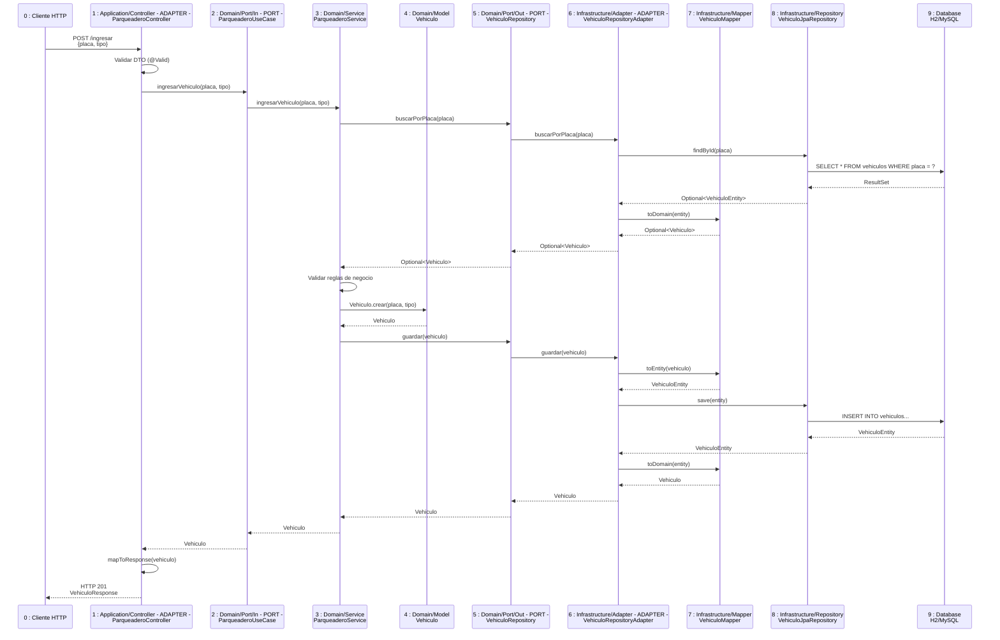

# 📍 Roadmap del Flujo de Datos - Arquitectura Hexagonal con Spring Boot y Gradle

## 🎯 Introducción

Este documento describe el flujo completo de una petición desde el puerto de entrada (REST Controller) hasta la persistencia en base de datos, siguiendo la **Arquitectura Hexagonal** (también conocida como Ports and Adapters) en un proyecto Spring Boot con Gradle.

---

## 🔄 Flujo Completo de una Petición HTTP

### 📊 Diagrama de Flujo - Arquitectura Hexagonal

```mermaid
flowchart TD
    A[0 : HTTP Request] --> B[1 : Application/Controller - ADAPTER -<br/>ParqueaderoController : 19]
    B --> C[2 : Application/DTO<br/>IngresoVehiculoRequest]
    C --> D[3 : Domain/Port/In - PORT -<br/>ParqueaderoUseCase]
    D --> E[4 : Domain/Service<br/>ParqueaderoService : 17]
    E --> F[5 : Domain/Model<br/>Vehiculo]
    E --> G[6 : Domain/Port/Out - PORT -<br/>VehiculoRepository : 16]
    G --> H[7 : Infrastructure/Adapter - ADAPTER -<br/>VehiculoRepositoryAdapter : 15]
    H --> I[8 : Infrastructure/Mapper<br/>VehiculoMapper : 14]
    I --> J[9 : Infrastructure/Repository<br/>VehiculoJpaRepository : 13]
    J --> K[10 : Infrastructure/Entity<br/>VehiculoEntity : 12]
    K --> L[11 : Database<br/>H2/MySQL]
    
    %% Respuesta de vuelta
    L --> K
    K --> J
    J --> I
    I --> H
    H --> G
    G --> E
    E --> M[18 : Application/DTO<br/>VehiculoResponse]
    M --> B
    B --> N[20 : HTTP Response]
    
    %% Styling por capas
    classDef webLayer fill:#222,stroke:#01579b,stroke-width:2px
    classDef domainLayer fill:#333,stroke:#4a148c,stroke-width:2px
    classDef infraLayer fill:#222,stroke:#1b5e20,stroke-width:2px
    classDef dataLayer fill:#333,stroke:#e65100,stroke-width:2px
    
    class A,B,C,M,N webLayer
    class D,E,F,G domainLayer
    class H,I,J,K infraLayer
    class L dataLayer
```

### 🔗 Diagrama de Secuencia - Flujo de Ingreso de Vehículo

### 🏗️ Arquitectura Hexagonal - Vista de Capas

```mermaid
graph TB
    subgraph "🌐 Web Layer (Adaptadores de Entrada)"
        WC[1 : Application/Controller - ADAPTER -<br/>ParqueaderoController : 19]
        DTO1[2 : Application/DTO<br/>IngresoVehiculoRequest]
        DTO2[18 : Application/DTO<br/>VehiculoResponse]
    end
    
    subgraph "🎯 Domain Layer (Hexágono)"
        subgraph "Puertos de Entrada"
            PI[3 : Domain/Port/In - PORT -<br/>ParqueaderoUseCase]
        end
        
        subgraph "Lógica de Negocio"
            SVC[4 : Domain/Service<br/>ParqueaderoService : 17]
            DOM[5 : Domain/Model<br/>Vehiculo]
        end
        
        subgraph "Puertos de Salida"
            PO[6 : Domain/Port/Out - PORT -<br/>VehiculoRepository : 16]
        end
    end
    
    subgraph "🔧 Infrastructure Layer (Adaptadores de Salida)"
        ADP[7 : Infrastructure/Adapter - ADAPTER -<br/>VehiculoRepositoryAdapter : 15]
        MAP[8 : Infrastructure/Mapper<br/>VehiculoMapper : 14]
        JPA[9 : Infrastructure/Repository<br/>VehiculoJpaRepository : 13]
        ENT[10 : Infrastructure/Entity<br/>VehiculoEntity : 12]
    end
    
    subgraph "💾 Data Layer"
        DB[11 : Database<br/>H2/MySQL]
    end
    
    WC --> DTO1
    DTO1 --> PI
    PI --> SVC
    SVC --> DOM
    SVC --> PO
    PO --> ADP
    ADP --> MAP
    MAP --> JPA
    JPA --> ENT
    ENT --> DB
    
    SVC --> DTO2
    DTO2 --> WC
    
    %% Styling
    classDef webStyle fill:#222,stroke:#01579b,stroke-width:2px
    classDef domainStyle fill:#333,stroke:#4a148c,stroke-width:3px
    classDef infraStyle fill:#222,stroke:#1b5e20,stroke-width:2px
    classDef dataStyle fill:#333,stroke:#e65100,stroke-width:2px
    
    class WC,DTO1,DTO2 webStyle
    class PI,SVC,DOM,PO domainStyle
    class ADP,MAP,JPA,ENT infraStyle
    class DB dataStyle
```

